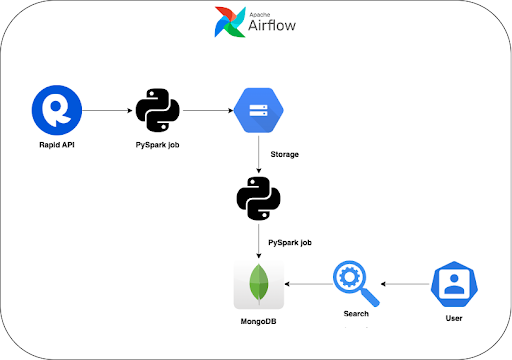

# Search Engine Pipeline

This repository is home to an advanced search engine pipeline that leverages PySpark, MongoDB, and Airflow to create a powerful and efficient search functionality. The pipeline retrieves product data from the ASOS API, stores it in Google Cloud Storage (GCS), and then loads it into MongoDB. Once the data is in MongoDB, it employs four different algorithms - BM25, TFIDF, Word2Vec, and BERT - to calculate relevancy scores and deliver a list of the top 10 most relevant items for a given search query. The performance of each algorithm is compared in the Jupyter notebook `model/NLP_Search.ipynb`.

## Architecture

## Table of Contents

- [Getting Started](#getting-started)
- [File Structure](#file-structure)
- [Usage](#usage)
- [Contributors](#contributors)
- [License](#license)

## Getting Started

### Prerequisites

To run this project, you will need the following:

- Python 3.7 or later
- PySpark 3.0.1 or later
- MongoDB 4.2 or later
- Airflow 2.0.0 or later
- Google Cloud Storage

### Installation

1. Clone the repository
2. Navigate to the project directory: 
   `cd search_engine_pipeline`
3. Install the necessary Python packages: 
   `pip install -r requirements.txt`

## File Structure

The repository contains the following files and directories:

- `utils/`: A collection of utility functions and configuration files
  - `product_indexing.py`: Retrieves product data from the ASOS API and stores it in a GCS bucket
  - `gcs_to_mongo.py`: A PySpark job that reads data from a GCS bucket and loads it into MongoDB
  - `user_definition.py`: Defines environment variables used across multiple files
  - `helper.py`: Contains various helper functions
  - `config.ini`: Stores the RapidAPI token and host details
- `model/`: Models for calculating relevance scores
  - `NLP_Search.ipynb`: A Jupyter notebook that demonstrates the application of each search algorithm (BM25, TFIDF, Word2Vec, and BERT), comparing their performances
- `dag/`: Airflow Directed Acyclic Graph (DAG) for orchestrating the pipeline
  - `search_engine_dag.py`: Defines the DAG and tasks for the search engine pipeline

## Usage

To run the search engine pipeline, follow these steps:

1. Set up your Airflow environment and configure the necessary connections, variables, and secrets.
2. Copy the `search_engine_dag.py` file into your Airflow `dags` folder.
3. Start the Airflow web server and scheduler: 
   `airflow webserver --port 8080` 
   `airflow scheduler`
4. Open the Airflow web interface at `http://localhost:8080` and enable the `search_engine-airflow` DAG.
5. The pipeline will run according to the specified schedule, or you can manually trigger it from the web interface.

## Contributors

This project was developed by:

- [Adit Shrimal](https://www.linkedin.com/in/aditshrimal/)
- [Varun Hande](https://www.linkedin.com/in/varunhande97/)
- [Neil Chitre](https://www.linkedin.com/in/neilchitre/)
- [Manav Middha](https://www.linkedin.com/in/manavmiddha/)

## License

This project is licensed under the MIT License - see the [LICENSE](https://opensource.org/license/mit/) file for details.